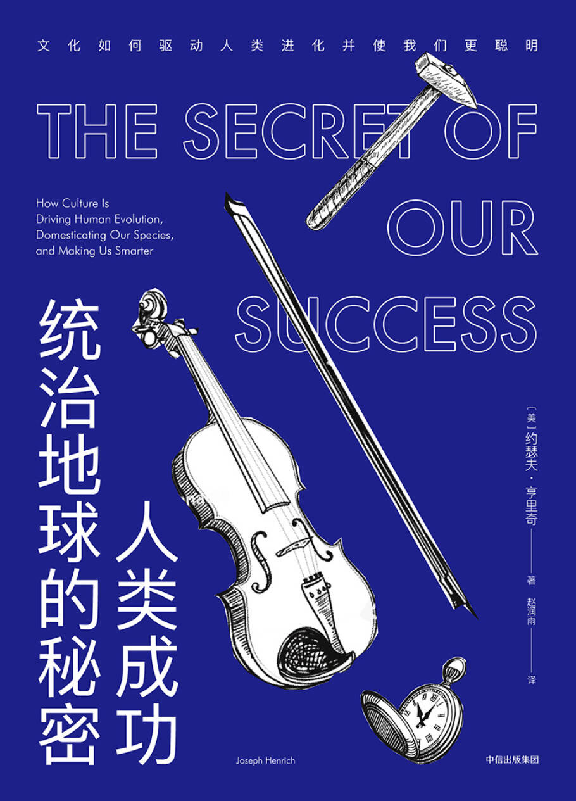

# 2021.1.2 

> 然而，社会规范经常会隐藏在表面之下并很难被发现。许多社会规范深刻地影响着我们看待这个世界的方式，以至很难想象有人可以对它进行反驳。
>
> ​                ———— 约瑟夫.亨里奇 《The Secret of Our Success: How Culture Is Driving Human Evolution, Domesticating Our Species,and Making Us Smarter》 

> 被内化的社会规范，是可以被意识并可以积极进行改造和学习的内容，开放的文化也是可以被内化的，进而融入开放源代码共同体。不过，这要看关于文化、社会的内容等积极的布道了。