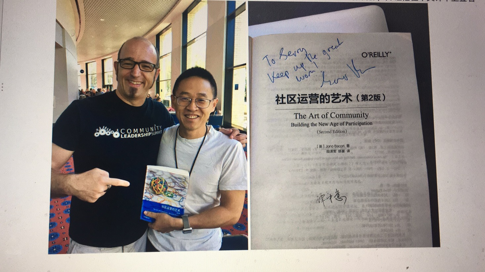

# 2021.12.11 

谭中意在阅读了陆奇的演讲：[陆奇如何解构一家企业？（内附书单）](https://mp.weixin.qq.com/s/8dasKoeTiNLNSu6wnyLyWg) 之后作了如下的转述：

> 内部开源是最好的工程师管理方式，工程师一般不会拍马屁、写报告，常常无法在职能评估中拿到相应的好结果。如果采用内部开源的方式，靠代码说话，大家以真正的能力来提升职业生涯。

这段理论确实非常的精髓，正如陆奇本人所谈：**开源是最好的工程师管理方式。** 精辟！