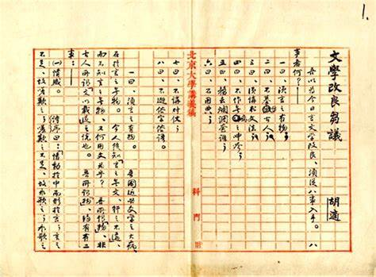

# 2021.2.12 

> 今之谈文学改良者众矣，记者末学不文，何足以言此？然年来颇于此事再四研思，辅以友朋辩论，其结果所得，颇不无讨论之价值。因综括所怀见解，列为八事，分别言之，以与当世之留意文学改良者一研究之。
>
> ​        ———— 胡适《文学改良刍议》

> 想要在某些封闭而落后的地方推广开源，无异于当年胡适先生提出的白话文运动，势必要颠覆一些东西。所以谦逊的态度还是要有的。