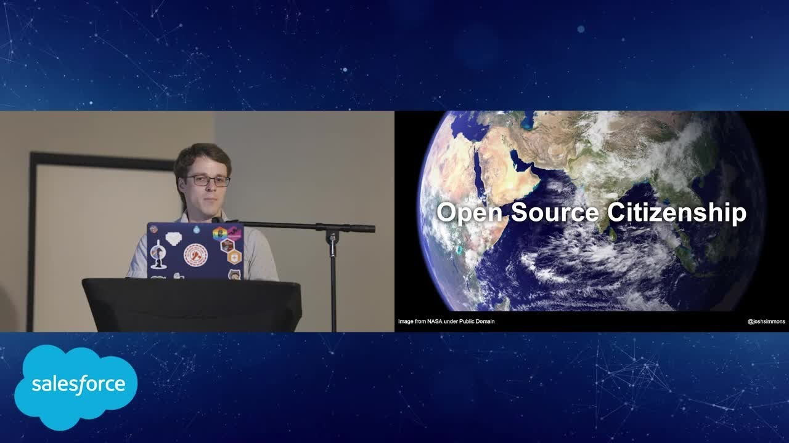

# 2021.2.15 

> 作为贡献者，如果不是我们去撰写开源那还有谁？如果真的没有人，那么我们的存在意义又是什么？
>
> ​      ———— [Josh Simmons](https://joshsimmons.com/) ,community strategist, open source advocate, and dusty- foot philosopher.

> 你就是“没有人”，如果人人都去做了，那还需要布道师做什么？你就可以安心的创作，行艺术之美。