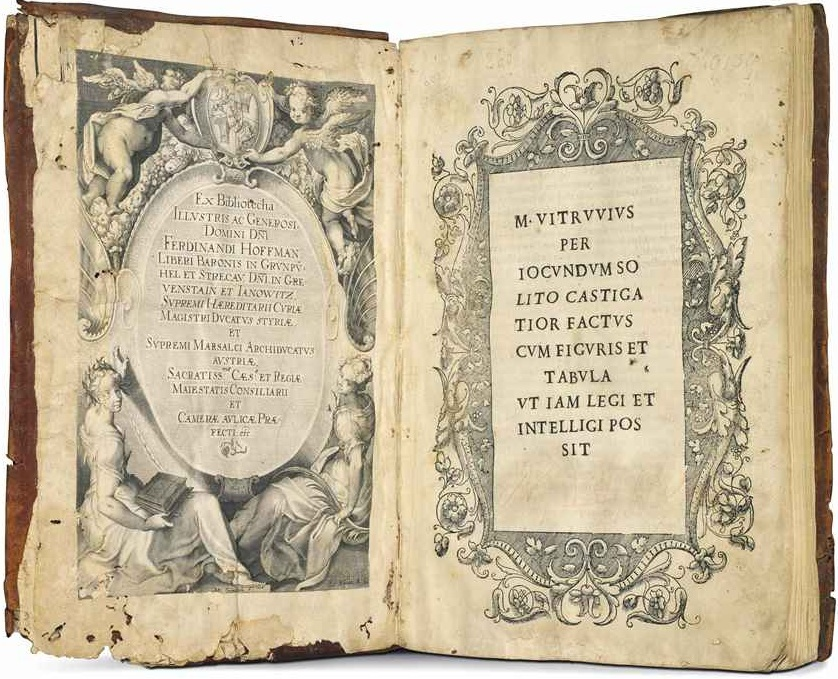

# 2021.2.7

> 建筑大师应为精通书面语言、绘画、几何学、算术以及光学，同时也不忽略天文学、历史、哲学、音乐、医学和法律的人。因为天文学为测量提供了基础知识；历史有助于装饰的设计；医学有助于规划供水系统和城市布局；熟知当地的法律，能够使民用建筑的建设合理而又顺利地进行；而知晓音乐，则使人动作协调，能根据音量调整起重机与弹射器的绳索张力强度。
>
> ​                  ———— 维特鲁威《建筑十书》

> 照葫芦画瓢，身为一名开源人，也应该具备工程、科技、人文、社会、经济、商业、心理等诸多学科的知识，以及一颗孜孜以求的好奇心！