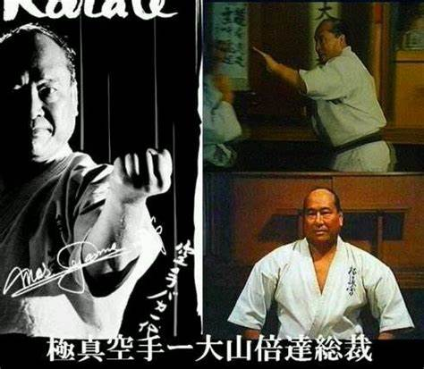

# 2021.6.3

极真空手道创始人 —— 大山倍达总裁，在1952年为避开铁板一块的传统空手道界的反对和质疑，大山倍达选择了“曲线救道”的理念，绕开日本本土，前往美国表演和踢馆。1956年，大山成立“极真会”的构想也在此时萌芽，“极真”二字的由来是取自于“千日修以返初心、万日炼以达极致”这句日本古文言。

极真空手道的崛起毋宁说是开放的力量，现代的竞技，从生理、饮食、空间想象、心理、体能进而达到人体的极限，这是一个科学的过程！必须是由人类全体的参与方能实现，而不是固步自封，局限一隅所能够达到的。想一下中国的武术发展就是一个最好的对比。
